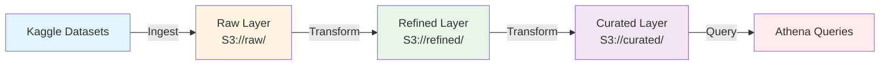

# E-commerce Data Lake

## Project Overview

This data lake project is designed for Kenyan e-commerce analytics using Kaggle datasets. The project provides a scalable architecture for ingesting, transforming, and querying e-commerce data to enable data-driven insights and analytics.

The data lake follows a medallion architecture pattern with layers for raw, refined, and curated data, enabling efficient data processing and analysis workflows. Datasets are enriched with Kenyan county mappings (e.g., Nairobi, Mombasa, Kisumu, Nakuru) to enable regional insights and county-level analytics.

## Tech Stack

- **PySpark**: Distributed data processing and transformation engine
- **AWS S3**: Object storage for data lake layers (raw, refined, curated)
- **AWS Glue**: Serverless ETL service for data cataloging and transformation
- **AWS Athena**: Interactive query service for SQL-based analytics
- **Delta Lake (delta-spark)**: ACID transactions and schema evolution for data lakes
- **Boto3**: AWS SDK for Python for AWS service interactions

## Architecture Diagram



### Data Flow

1. **Sources**: Kaggle datasets containing Kenyan e-commerce data
2. **Raw Layer**: Unprocessed, original data stored in S3
3. **Refined Layer**: Cleaned and standardized data with basic transformations
4. **Curated Layer**: Business-ready, aggregated data optimized for analytics
5. **Athena Queries**: SQL queries for analytics and reporting

## Kenyan Context & Data Enrichment

### County Mapping

This project adapts Kaggle e-commerce datasets for Kenyan market analysis by enriching location data with county mappings. Key counties include:

- **Nairobi County**: Capital city, major commercial hub
- **Mombasa County**: Coastal region, port city
- **Kisumu County**: Western Kenya, Lake Victoria region
- **Nakuru County**: Rift Valley, agricultural center
- **And 43 additional counties** across Kenya

### Regional Insights

The county mapping enables:

- **County-level sales analysis**: Understand e-commerce performance by region
- **Regional demand patterns**: Identify buying trends across different counties
- **Delivery optimization**: Analyze shipping costs and delivery times by region
- **Market segmentation**: Tailor marketing strategies to county-specific preferences
- **Economic indicators**: Correlate e-commerce activity with regional economic data

### Data Transformation

During the transformation pipeline, address and location data from raw datasets are:
1. Standardized to Kenyan county format
2. Enriched with county metadata (region, population, economic indicators)
3. Geocoded for spatial analysis (latitude/longitude)
4. Aggregated at county level for regional reporting

This enrichment happens in the **Refined Layer** during data transformation, making county-level analytics readily available in the **Curated Layer**.

## Setup Instructions

### Prerequisites

- Python 3.8 or higher
- AWS Account (Free Tier eligible)
- AWS CLI configured with credentials
- Java 8 or 11 (required for PySpark)

### Local Setup

1. **Clone the repository**
   ```bash
   git clone https://github.com/CippyCabana1109/ecommerce-data-lake.git
   cd ecommerce-data-lake
   ```

2. **Create a virtual environment**
   ```bash
   python -m venv venv
   # On Windows
   venv\Scripts\activate
   # On macOS/Linux
   source venv/bin/activate
   ```

3. **Install dependencies**
   ```bash
   pip install -r requirements.txt
   ```

4. **Configure AWS credentials**
   ```bash
   aws configure
   ```
   Or set environment variables:
   ```bash
   export AWS_ACCESS_KEY_ID=your_access_key
   export AWS_SECRET_ACCESS_KEY=your_secret_key
   export AWS_DEFAULT_REGION=us-east-1
   ```

5. **Set up AWS S3 buckets** (using AWS Free Tier)
   - Create S3 buckets: `your-bucket-raw`, `your-bucket-refined`, `your-bucket-curated`
   - Update bucket names in `configs/config.yaml`

### PySpark Local Setup

For local development without AWS:

1. **Set Spark home** (if not in PATH)
   ```bash
   export SPARK_HOME=/path/to/spark
   export PYTHONPATH=$SPARK_HOME/python:$PYTHONPATH
   ```

2. **Run Spark locally**
   ```python
   from pyspark.sql import SparkSession
   
   spark = SparkSession.builder \
       .appName("EcommerceDataLake") \
       .master("local[*]") \
       .getOrCreate()
   ```

## How to Run

### 1. Data Ingestion
```bash
# Ingest raw data to S3
python src/ingest/ingest_data.py

# Or run specific ingestion scripts
python src/ingest/download_kaggle_data.py
python src/ingest/upload_to_s3.py
```

### 2. Data Transformation
```bash
# Process raw data to refined layer with Delta Lake
spark-submit src/transform/process_to_refined.py

# Create curated views with aggregations
spark-submit src/transform/create_curated.py
```

### 3. Query via Athena
```bash
# Set up Glue catalog and crawlers
python src/queries/setup_catalog.py

# Run Athena queries (via console or CLI)
# See src/queries/insights.sql for sample queries
```

### 4. Testing
```bash
# Run all tests
pytest tests/ -v

# Run specific test categories
pytest tests/test_lake.py::TestIngestion -v
pytest tests/test_lake.py::TestTransformations -v
pytest tests/test_lake.py::TestCuratedAggregations -v
```

## Usage

### Data Ingestion

Place your Kaggle datasets in the `data/samples/` directory and run ingestion scripts:

```bash
python src/ingest/ingest_data.py
```

### Data Transformation

Run transformation pipelines to process data through the layers. County mapping and regional enrichment are applied during transformation:

```bash
python src/transform/process_to_refined.py  # Raw to Refined with Delta Lake
python src/transform/create_curated.py     # Refined to Curated with aggregations
```

### Querying Data

Execute Athena queries or use notebooks for exploratory analysis. Example queries include county-level sales, regional trends, and delivery analytics:

```bash
# Set up Glue catalog first
python src/queries/setup_catalog.py

# Using Athena queries (see src/queries/insights.sql)
# Access via AWS Athena console or AWS CLI

# Or use Jupyter notebooks
jupyter notebook notebooks/
```

### County-Level Analytics Examples

- **Sales by County**: `SELECT county, SUM(amount) as total_sales FROM curated.sales GROUP BY county`
- **Top Performing Counties**: Analyze revenue, order volume, and customer retention by county
- **Regional Delivery Metrics**: Compare delivery times and costs across different counties

### Project Structure

```
ecommerce-data-lake/
├── src/
│   ├── ingest/          # Data ingestion scripts
│   ├── transform/       # Data transformation pipelines
│   │   ├── process_to_refined.py    # Raw to Refined with Delta Lake
│   │   └── create_curated.py       # Refined to Curated with aggregations
│   └── queries/         # Athena query scripts
│       ├── setup_catalog.py         # Glue catalog setup
│       └── insights.sql             # Business intelligence queries
├── tests/
│   ├── test_lake.py     # Comprehensive pytest suite
│   ├── conftest.py      # Pytest configuration
│   └── __init__.py      # Test package init
├── data/
│   ├── samples/         # Sample datasets
│   └── lineage/         # Governance and lineage logs
├── notebooks/           # Jupyter notebooks for exploration
├── configs/             # Configuration files
├── requirements.txt     # Python dependencies
└── README.md           # This file
```

### Key Features

- **Delta Lake Integration**: ACID transactions and versioning for data reliability
- **Data Quality Checks**: Automated validation at each transformation step
- **Lineage Logging**: Complete audit trail for governance and compliance
- **Comprehensive Testing**: Pytest-based unit and integration tests
- **County-Level Analytics**: Kenyan regional insights and aggregations
- **AWS Glue Integration**: Automated catalog management and crawling

## Contributing

1. Fork the repository
2. Create a feature branch
3. Make your changes
4. Submit a pull request

## License

This project is open source and available under the MIT License.
