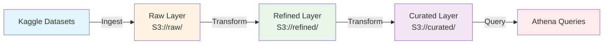

# E-commerce Data Lake

## Project Overview

This data lake project is designed for Kenyan e-commerce analytics using Kaggle datasets. The project provides a scalable architecture for ingesting, transforming, and querying e-commerce data to enable data-driven insights and analytics.

The data lake follows a medallion architecture pattern with layers for raw, refined, and curated data, enabling efficient data processing and analysis workflows.

## Tech Stack

- **PySpark**: Distributed data processing and transformation engine
- **AWS S3**: Object storage for data lake layers (raw, refined, curated)
- **AWS Glue**: Serverless ETL service for data cataloging and transformation
- **AWS Athena**: Interactive query service for SQL-based analytics
- **Delta Lake (delta-spark)**: ACID transactions and schema evolution for data lakes
- **Boto3**: AWS SDK for Python for AWS service interactions

## Architecture Diagram



### Data Flow

1. **Sources**: Kaggle datasets containing Kenyan e-commerce data
2. **Raw Layer**: Unprocessed, original data stored in S3
3. **Refined Layer**: Cleaned and standardized data with basic transformations
4. **Curated Layer**: Business-ready, aggregated data optimized for analytics
5. **Athena Queries**: SQL queries for analytics and reporting

## Setup Instructions

### Prerequisites

- Python 3.8 or higher
- AWS Account (Free Tier eligible)
- AWS CLI configured with credentials
- Java 8 or 11 (required for PySpark)

### Local Setup

1. **Clone the repository**
   ```bash
   git clone https://github.com/CippyCabana1109/ecommerce-data-lake.git
   cd ecommerce-data-lake
   ```

2. **Create a virtual environment**
   ```bash
   python -m venv venv
   # On Windows
   venv\Scripts\activate
   # On macOS/Linux
   source venv/bin/activate
   ```

3. **Install dependencies**
   ```bash
   pip install -r requirements.txt
   ```

4. **Configure AWS credentials**
   ```bash
   aws configure
   ```
   Or set environment variables:
   ```bash
   export AWS_ACCESS_KEY_ID=your_access_key
   export AWS_SECRET_ACCESS_KEY=your_secret_key
   export AWS_DEFAULT_REGION=us-east-1
   ```

5. **Set up AWS S3 buckets** (using AWS Free Tier)
   - Create S3 buckets: `your-bucket-raw`, `your-bucket-refined`, `your-bucket-curated`
   - Update bucket names in `configs/config.yaml`

### PySpark Local Setup

For local development without AWS:

1. **Set Spark home** (if not in PATH)
   ```bash
   export SPARK_HOME=/path/to/spark
   export PYTHONPATH=$SPARK_HOME/python:$PYTHONPATH
   ```

2. **Run Spark locally**
   ```python
   from pyspark.sql import SparkSession
   
   spark = SparkSession.builder \
       .appName("EcommerceDataLake") \
       .master("local[*]") \
       .getOrCreate()
   ```

## Usage

### Data Ingestion

Place your Kaggle datasets in the `data/samples/` directory and run ingestion scripts:

```bash
python src/ingest/ingest_data.py
```

### Data Transformation

Run transformation pipelines to process data through the layers:

```bash
python src/transform/transform_raw_to_refined.py
python src/transform/transform_refined_to_curated.py
```

### Querying Data

Execute Athena queries or use notebooks for exploratory analysis:

```bash
# Using Athena queries
python src/queries/run_query.py

# Or use Jupyter notebooks
jupyter notebook notebooks/
```

### Project Structure

```
ecommerce-data-lake/
├── src/
│   ├── ingest/          # Data ingestion scripts
│   ├── transform/       # Data transformation pipelines
│   └── queries/         # Athena query scripts
├── data/
│   └── samples/         # Sample datasets
├── notebooks/           # Jupyter notebooks for exploration
├── configs/             # Configuration files
├── requirements.txt     # Python dependencies
└── README.md           # This file
```

## Contributing

1. Fork the repository
2. Create a feature branch
3. Make your changes
4. Submit a pull request

## License

This project is open source and available under the MIT License.
